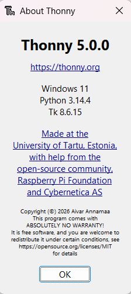
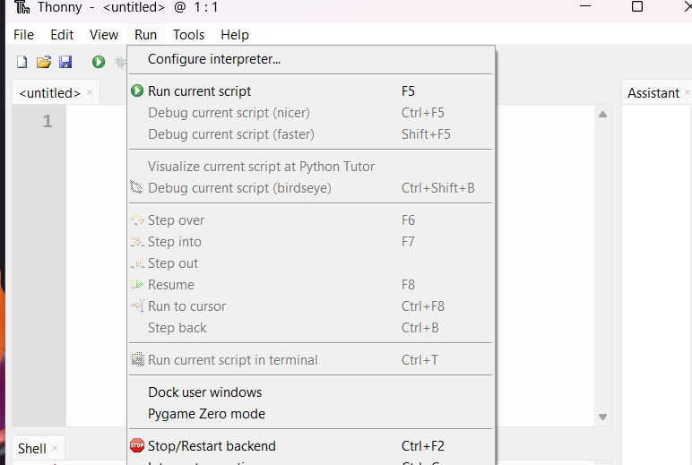
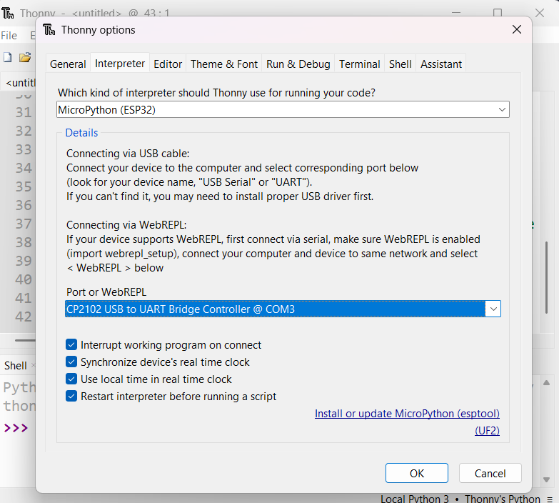
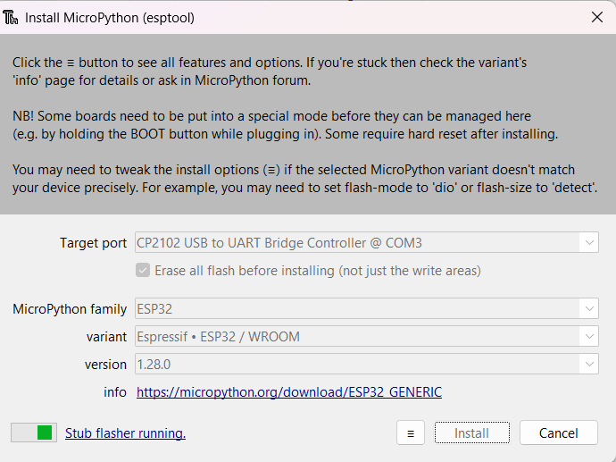

# projekt_WebServer_ESP32_ucili-te_Brod

Thonny MicroPython web server projekt

## ESP32 WiFi LED — Jednostavan IoT projekt

Ovaj projekt sadrži jednostavan MicroPython web server za ESP32 koji upravlja jednim LED‑om preko web sučelja.

## Sadržaj
- `src/main.py`: Glavni program za ESP32
- `src/secrets.py`: Mjesto za `ssid` i `password`
- `images/`: Mapa za screenshotove iz Thonny i fotografije uređaja
- `.gitignore`: preporučene stavke za ignoriranje

## Kako koristiti
1. Otvorite `src/secrets.py` i unesite svoju Wi‑Fi mrežu:

```python
ssid = 'MOJ_SSID'
password = 'MOJA_LOZINKA'
```

2. Učitajte `src/main.py` i `src/secrets.py` na ESP32 koristeći Thonny ili drugi alat za MicroPython. Preporučeno ime datoteke na uređaju: `main.py`.

3. Pokrenite uređaj. U Thonny konzoli će se pokazati IP adresa uređaja (npr. `192.168.1.42`).

4. Otvorite tu adresu u pregledniku i kliknite gumbe za uključivanje ili isključivanje LED‑a.

## Foto dokumentacija
U mapi `images/` nalaze se screenshotovi iz Thonny koji dokumentiraju:
-Flashanje:






## Primjer Git naredbi

```bash
git init
git add .
git commit -m "Initial ESP32 WiFi LED project"
git branch -M main
git remote add origin <VAŠ_GIT_URL>
git push -u origin main
```

## Napomene za profesora
- Projekt koristi MicroPython i ESP32.
- Web server je jednostavan i demonstrira IoT upravljanje LED-om preko lokalnog Wi-Fi web sučelja.
- `src/secrets.py` držite s placeholder vrijednostima prije dijeljenja.
